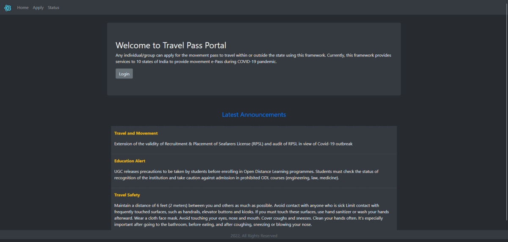

<a name="readme-top"></a>


<!-- PROJECT LOGO -->
<br />
<div align="center">
  <a>
    
  </a>

<br />
<h1 align="center">Travel-Permissions Management Portal</h1>

  
  

  <p align="center">
    Frontend Application built using ReactJS to accept, reject and manage travel permissions raised by the appication users.
    <br />
    <br/>
    <a href="http://epass-portal.herokuapp.com/">View Demo</a> · 
    <a href="https://github.com/bqwerr/react-epass-portal">Repository</a>
    <!-- · <a href="https://bqwerr.github.io">Explore the docs</a> -->
    ·
    <a href="https://github.com/bqwerr">View More »</a>
  </p>
</div>

<br />

<!-- TABLE OF CONTENTS -->
<details>
  <summary>Table of Contents</summary>
  <ol>
    <li>
      <a href="#about-the-project">About The Project</a>
      <ul>
        <li><a href="#built-with">Built With</a></li>
      </ul>
    </li>
    <li>
      <a href="#getting-started">Getting Started</a>
      <ul>
        <li><a href="#prerequisites">Prerequisites</a></li>
        <li><a href="#installation">Installation</a></li>
      </ul>
    </li>
    <li><a href="#usage">Usage</a></li>
    <li><a href="#roadmap">Roadmap</a></li>
    <!-- <li><a href="#contributing">Contributing</a></li> -->
    <!-- <li><a href="#license">License</a></li> -->
    <li><a href="#contact">Contact</a></li>
    <!-- <li><a href="#acknowledgments">Acknowledgments</a></li> -->
  </ol>
</details>


<br />

<!-- ABOUT THE PROJECT -->
## About The Project
<br />

[](http://epass-portal.herokuapp.com/)

This repository has frontend components built using <a href="https://reactjs.org/">ReactJS</a>. The main objective of this application is to create a user friendly dashboard for the travel admins, to view the applications raised by the users. This application consumes the backend API <a href="https://github.com/bqwerr/spring-epass-service">Travel Management Service</a> to accept, reject and manage travel permissions.

<br />


### Built With

[](https://skillicons.dev)


<br />

<!-- GETTING STARTED -->
## Getting Started

To get a local copy of thsi frontend application up and running follow these example steps.

### Prerequisites

* NodeJS has to be installed in the local system.

### Installation

1. Clone the repo
   ```sh
   git clone https://github.com/bqwerr/react-epass-portal.git
   ```
2. Open a terminal inside the folder ```react-epass-portal``` and run command ```npm install```.
3. Now run the command ```npm start```.
4. Open http://localhost:3000 to view the application running in the browser.

- To get the backend API for this application, please refer this <a href="https://github.com/bqwerr/spring-epass-service">repository</a>

<br />


<!-- USAGE EXAMPLES -->
## Usage

_For usage of endpoints, please refer to the [Documentation](https://htmlpreview.github.io/?https://github.com/bqwerr/spring-epass-service/blob/master/documentation.htm)_

- Create a user using the ```/api/auth/signup``` endpoint from the above documentation.
- Then you may be able to use the credentials to login to the site

<br />


<!-- ROADMAP -->
## Roadmap

- [x] Create Java Backend API endpoints for Authentication & Authorization, Managing User Permissions & Admin Posts.
- [x] Secure API endpoints using JWT Authentication
    - [x] Refresh Token functionality was enabled to extend user session
- [x] Create API Docuementation
- [x] Create a frontend dashboard & consume the API
- [ ] ResponseEntity Manipulations with Response Status
<br />

<!-- See the [open issues](https://github.com/github_username/repo_name/issues) for a full list of proposed features (and known issues). -->


<!-- CONTRIBUTING -->
<!-- ## Contributing
Contributions are what make the open source community such an amazing place to learn, inspire, and create. Any contributions you make are **greatly appreciated**.
If you have a suggestion that would make this better, please fork the repo and create a pull request. You can also simply open an issue with the tag "enhancement".
Don't forget to give the project a star! Thanks again!
1. Fork the Project
2. Create your Feature Branch (`git checkout -b feature/AmazingFeature`)
3. Commit your Changes (`git commit -m 'Add some AmazingFeature'`)
4. Push to the Branch (`git push origin feature/AmazingFeature`)
5. Open a Pull Request
<br /> -->


<!-- CONTACT -->

## Contact

[GMail][gmail] · [LinkedIn][linkedin] · [GitHub][github] · [Website][website] 


<!-- ACKNOWLEDGMENTS / REFERENCES -->
<!-- ## References
* []()
* []()
* []() -->


[website]: https://bqwerr.github.io
[linkedin]: https://linkedin.com/in/srujan-tumma
[gmail]: mailto:tummasrujan@gmail.com
[github]: https://github.com/bqwerr
